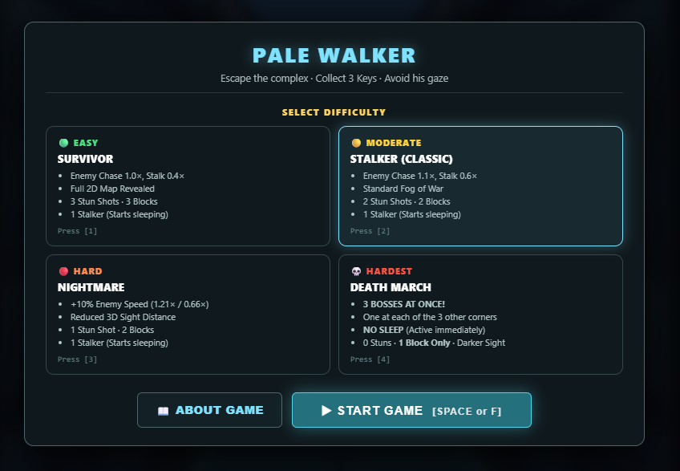
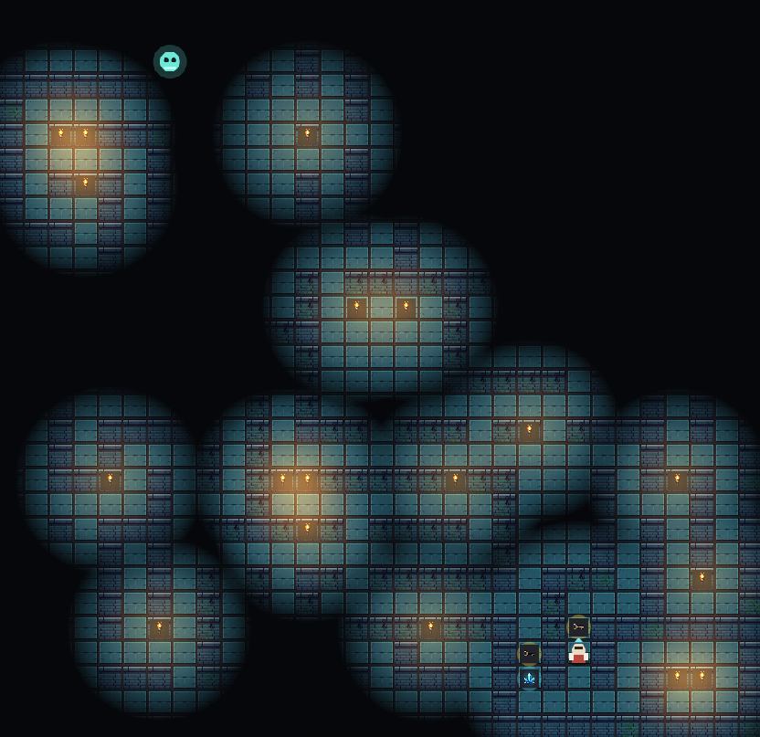
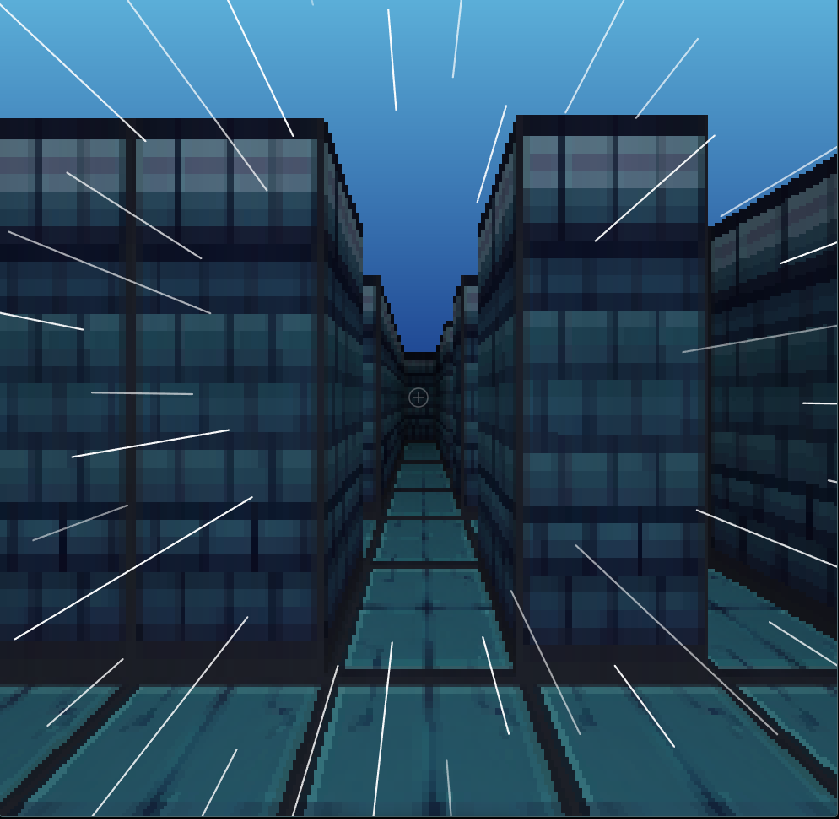
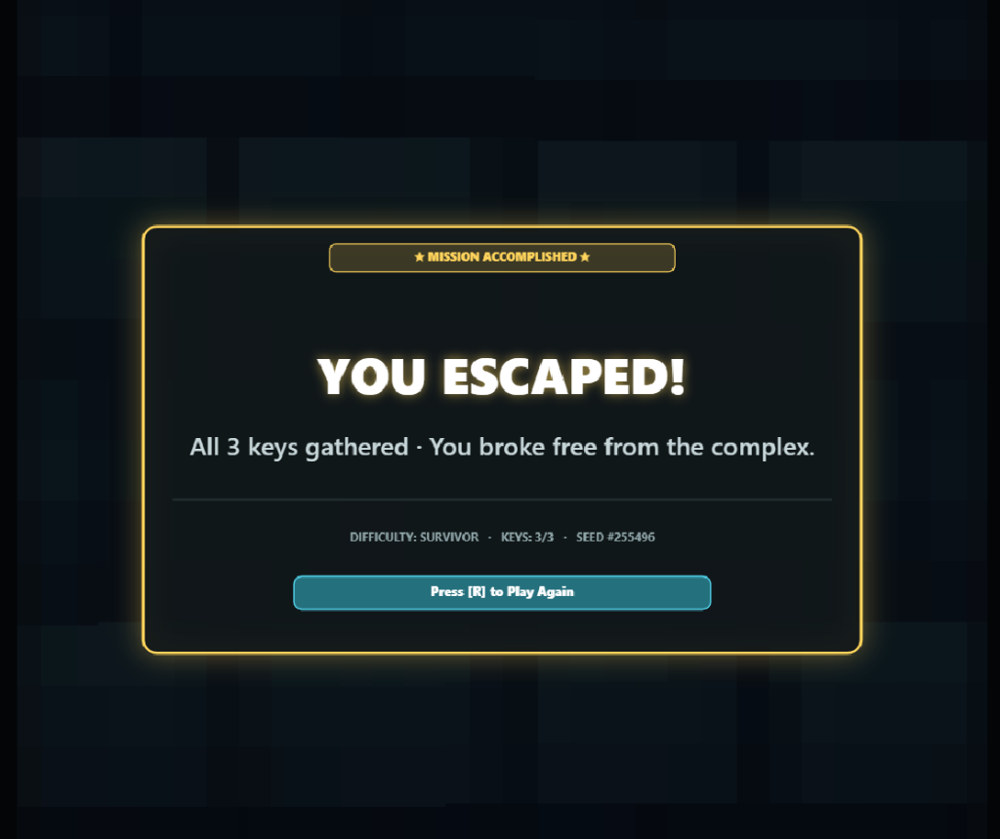
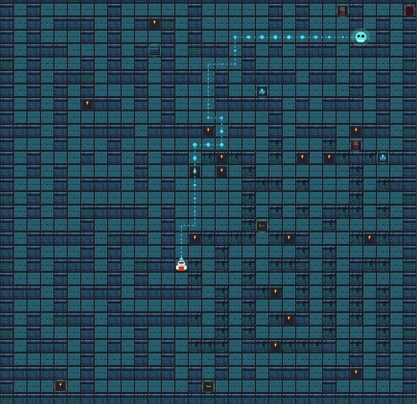

# 🏰 PALE WALKER

Direct Link to try out : https://game.amyaseen.com/home.html

> **A retro survival-horror dungeon crawler featuring dual-perspective rendering (2D Top-Down & 3D Pseudo-Raycaster), dynamic atmospheric torch lighting, procedural seeded labyrinth generation, and an unrelenting stalking entity driven by real-time BFS pathfinding.**

<p align="center">
  
</p>

<p align="center">
  
  
  
  
  
</p>

---

## 🎮 Player Guide & Overview

**PALE WALKER** plunges you into an ancient, dark stone labyrinth generated procedurally with every run. You are not alone—an ominous, sensitive entity stalks the stone corridors, reacting to your actions.

Your mission is simple, yet every step through the dark could be your last:
1. 🔦 **Find the Torch** to illuminate pitch-black unlit chambers.
2. 🗝️ **Locate all 3 Keys** hidden across the labyrinth.
3. 🏃 **Unlock the Exit Stairs** and escape before the creature catches you.

Switch instantaneously at any moment between a classic **2D top-down dungeon crawler** and an intense **3D retro first-person raycaster** (reminiscent of *Wolfenstein 3D* and *Daggerfall*).

---

## 👁️ Dual Perspective Modes

Experience the labyrinth from two complementary viewpoints tailored for both tactical planning and heart-pounding survival:

### 1. 2D Top-Down View (Tactical Spatial Awareness)
Navigate with a top-down tactical overview featuring smooth autotiled pixel art, organic radial torchlight, and dynamic fog-of-war darkness. Spot keys, resources, and stalker silhouettes lurking just beyond your lantern radius.

<p align="center">
  
</p>

### 2. 3D Pseudo-Raycaster View (First-Person Claustrophobia)
Switch into a retro 90s first-person perspective rendered via a real-time DDA (Digital Differential Analyzer) raycaster. Hear echoing footsteps, peer down narrow stone halls, and feel the adrenaline surge with dynamic speed lines and screen shakes when pursued.

<p align="center">
  
</p>

---

## 💀 Difficulty Levels: Choose Your Nightmare

Before stepping into the labyrinth, select the difficulty level that suits your nerve:

| Difficulty | Enemy Chase / Stalk Speed | Stun Shots | Barricade Blocks | 2D Map Reveal | Stalker Behavior & Modifiers |
| :--- | :--- | :---: | :---: | :---: | :--- |
| 🟢 **SURVIVOR** *(Easy)* | Chase `1.0×` · Stalk `0.4×` | 3 | 3 | Full Map Revealed | 1 Stalker (dormant until 1st key collected). Ideal for learning layouts. |
| 🟡 **STALKER** *(Classic)* | Chase `1.1×` · Stalk `0.6×` | 2 | 2 | Fog of War Active | 1 Stalker (dormant until 1st key collected). Balanced survival experience. |
| 🔴 **NIGHTMARE** *(Hard)* | Chase `1.21×` · Stalk `0.66×` | 1 | 2 | Fog of War Active | +10% Stalker speed, reduced 3D view distance (`10` cells), no free map scrolls. |
| ☠️ **DEATH MARCH** *(Hardest)* | Chase `1.2×` · Stalk `1.0×` | 0 | 1 | Darker Fog of War | **3 BOSSES AT ONCE!** Spawned at the other 3 corners. **NO SLEEP** (active immediately from second zero). 0 Stuns, 1 Block only. |

---

## 🎒 Survival Arsenal & Abilities

Surviving against the Pale Walker requires smart resource conservation and quick reflexes:

- 🏃 **Sprint (`Shift`)**: Activate a surge of speed to break line-of-sight during chases. Features a visual FOV warp effect and a short cooldown.
- ⚡ **Stun Shot (`1`)**: Fire an energetic cyan blast directly toward the stalker, freezing it in place for **3.5 seconds**.
- 🧱 **Barricade Crate (`2`)**: Drop heavy wooden crates in doorways or 1-cell corridors to force the AI to recalculate its path or block it entirely.
- 🗺️ **Map Scroll**: Instantly reveals the entire dungeon floor plan and clears fog of war.
- 🔦 **Torch**: Greatly extends your vision radius in 2D mode and illuminates deep corridors in 3D mode.
- ⟲ **180° Snap Turn (`Space`)**: Instantly whip your camera around in 3D mode when you hear breathing behind you.

---

## 🏆 Escape Progression

<p align="center">
  
</p>

1. **Phase 1: Scavenge & Prepare** — Spawn in a starter room. Scout safe corridors, grab the torch, and gather defensive crystals and crates.
2. **Phase 2: The Awakening** — Grab your first key. The Stalker awakens from its slumber and begins actively roaming toward your location.
3. **Phase 3: Evasion & Pursuit** — As you search for the remaining keys, avoid crossing paths with the creature. If it spots you, it screeches and enters a **5-second windup** before launching into an all-out sprint.
4. **Phase 4: Breakout** — With all 3 keys collected, race to the glowing dungeon exit portal to secure your escape.

---

## ⌨️ Controls & Keybindings

| Action | Keyboard | Touch / On-Screen |
| :--- | :--- | :--- |
| **Move Up / Forward** | `W` or `▲ Up Arrow` | `▲` |
| **Move Down / Backward**| `S` or `▼ Down Arrow` | `▼` |
| **Move / Turn Left** | `A` or `◀ Left Arrow` | `◀` |
| **Move / Turn Right** | `D` or `▶ Right Arrow` | `▶` |
| **180° Snap Turn** | `Space` | `⟲ 180` |
| **Sprint** | `Shift` | `Sprint` |
| **Interact / Pick Up** | `E` | `E pick up` |
| **Stun Shot** | `1` | `Stun` |
| **Place Barricade** | `2` | `Block` |
| **Toggle 2D / 3D View** | `C` | `View: 2D/3D` |
| **Toggle BFS Path Debug**| `B` | `BFS: ON/OFF` |
| **Toggle Mute / Unmute** | `M` | `🔊 Audio: On/Off` |
| **Restart Game** | `R` | `Restart` |
| **Toggle Fullscreen** | Click button | `⛶ Fullscreen` |
| **Toggle Controls Pad** | Click button | `⌨ Controls: On/Off` |

> **Perspective Differences**:
> - **2D Mode**: Omnidirectional movement in screen-space; items are automatically picked up when walked over.
> - **3D Mode**: First-person tank controls (◀▶ turn camera angle, ▲ moves forward, ▼ steps back; press `E` to interact/collect).

---

## ⚙️ Technical Architecture & Under the Hood

### 1. Real-Time BFS Pathfinding & Stalker AI
The stalker entity employs an optimized **Breadth-First Search (BFS)** grid algorithm running on every AI decision tick to compute shortest paths across the dynamic maze geometry:

<p align="center">
  
</p>

- **Dynamic Obstacle Avoidance**: Barricade crates placed by the player dynamically alter grid solid state (`g[y][x] === 1 || isBlock(x,y)`), forcing the AI to re-route on the fly.
- **State Machine (SCP-096 Inspired)**:
  - `IDLE`: Dormant at the opposite corner of the map until the player collects key #1.
  - `STALK`: Silently searches through corridors toward the player's last known sector.
  - `WINDUP`: Triggers when line-of-sight is established. Emits an agonizing shriek, builds rage over a 5-second countdown, giving the player a brief window to flee or hide.
  - `CHASE`: Bursts into high-speed pursuit that outpaces standard walking speed.
  - `STUN`: Stun shots incapacitate the creature for 3.5 seconds, resetting line-of-sight.
- **Live Debug Visualization**: Pressing `B` toggles the live pathfinding renderer, displaying the real-time vector path connecting the stalker directly to the player.

---

### 2. Custom 3D Software Raycasting Engine
Built from scratch without WebGL or 3D graphics libraries:
- **DDA Algorithm**: Implements Digital Differential Analysis on a 186×186 internal framebuffer. Ray-stepping traverses grid tiles in $O(\text{distance})$ time.
- **Depth Buffering (`zb`)**: Tracks Euclidean and perpendicular distances to prevent fisheye distortion and properly sort billboarded sprite objects (keys, torches, crystals, stalker sprites) behind foreground walls.
- **Nearest-Neighbor Upscaling**: The low-resolution framebuffer is scaled to full display size with `image-rendering: pixelated`, achieving an authentic 1990s retro PC aesthetic at a silky 60 FPS.

---

### 3. Dynamic Lighting & Darkness Pipeline
Lighting is generated via an offscreen canvas composite pipeline:
- **Darkness Alpha Layer**: The screen is covered with an ambient darkness layer (`rgba(0, 0, 0, 0.93)`).
- **Radial Torch Cutouts**: Player vision and wall-mounted torches carve soft visibility halos out of the darkness mask using `destination-out` composite blending.
- **Warm Ambient Bloom**: An additive blending pass (`lighter`) adds warm amber light (`rgba(255, 140, 40, 0.25)`) surrounding active torch flames with organic periodic flicker.

---

### 4. Dynamic Procedural Audio Engine
The audio subsystem provides an adaptive soundscape based on proximity and danger:
- **Layered Audio States**:
  - `menu.mp3`: Eerie ambient track playing during difficulty selection.
  - `stalk.mp3`: Subtle, tension-building ambient loop playing during stalk phases.
  - `rage.mp3` & `rage_near.mp3`: Screaming pursuit tracks with volume automatically modulated based on Euclidean distance to the player.
  - `chase_caught_cut.mp3` & `silentcaught.mp3`: Sudden capture stingers.
  - `victory.mp3`: Victorious fanfare upon escape.
- **Audio Control**: Quick toggle with `M` or dedicated UI buttons, with automatic mute persistence.

---

### 5. Procedural Room-First Dungeon Generation
- **Mulberry32 Seeded PRNG**: Every match generates a 6-digit seed (e.g. `#255496`) enabling reproducible maze layouts.
- **Room Carving & Spanning Maze**: Places central halls and dispersed chambers (5×5 to 11×9 cells) first, then weaves 2–3 cell wide corridors using randomized recursive backtracker carving.
- **Guaranteed Solvability**: Graph connectivity validation ensures 100% reachability from spawn to all 3 keys, torch, items, and the exit staircase without unreachable islands.

---

## 📁 Project Structure

```text
pale-walker/
├── Assets/
│   ├── audio/                                    # Dynamic soundtrack & SFX
│   │   ├── chase_caught_cut.mp3
│   │   ├── menu.mp3
│   │   ├── rage.mp3
│   │   ├── rage_near.mp3
│   │   ├── silentcaught.mp3
│   │   ├── stalk.mp3
│   │   └── victory.mp3
│   ├── tiles/                                    # 32x32 pixel art autotiles & items
│   │   ├── wall_*.png                            # Autotiled wall borders & solid interiors
│   │   ├── floor_*.png                           # Normal, cracked, mossy, broken stone variants
│   │   ├── door_*.png                            # Interactive entrance/exit portals
│   │   ├── torch.png                             # Wall-mounted torch sprites
│   │   ├── stairs.png                            # Exit staircase portal
│   │   ├── key.png                               # Labyrinth keys
│   │   ├── crate.png / barrel.png                # Deployable obstacle barricades
│   │   └── crystal_*.png                         # Cyan (Stun) & Purple (Map) crystals
│   ├── Gemini_Generated_Image_xjz5auxjz5auxjz5.png # Master sprite texture atlas
│   ├── menu_difficulty.png                       # Difficulty selector & menu screenshot
│   ├── gameplay_2d_fog_of_war.png                # 2D torchlight & fog of war screenshot
│   ├── gameplay_3d_raycaster.png                 # 3D pseudo-raycaster screenshot
│   ├── gameplay_2d_bfs_pathfinding.png           # Real-time BFS pathfinding debug screenshot
│   └── victory_screen.png                        # Game victory completion screenshot
├── home.html                                     # Complete standalone game application
├── LICENSE                                       # Project license
├── vercel.json                                   # Deployment configuration
└── README.md                                     # Documentation
```

---

## 🚀 Running the Game

Because **PALE WALKER** is built with vanilla HTML5, Canvas, and JavaScript with **zero external npm packages or build steps**, it can be launched immediately:

### Option 1: Direct File Launch
Double-click `home.html` or open it directly in any modern web browser (Google Chrome, Firefox, Microsoft Edge, Safari).

### Option 2: Local HTTP Server (Recommended)
Running through an HTTP server ensures optimal audio and asset loading across all browsers:

```bash
# Navigate to the game folder
cd pale-walker

# Start Python 3's built-in web server
python -m http.server 8000
```

Open `http://localhost:8000/home.html` in your browser.

---

## 📜 License

Distributed under the Apache 2.0 License. See [LICENSE](LICENSE) for details.
